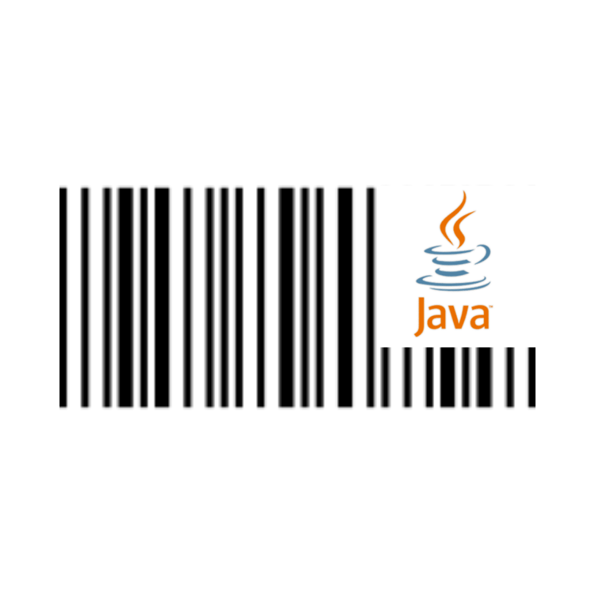

  

<h3 align="center">Codbar Printer</h3>

---

 This projects is a simple program that prints labels.
      

## 📝 Table of Contents

- [About](#about)
- [Getting Started](#getting_started)
- [Built Using](#built_using)
- [Authors](#authors)

## 🧐 About 

This project was made for my old job, and was made for one purpose: print labels.
I used Java to make it, and the project connect to the database and get the results of the products like: name, code, etc. And use this datas to print the labels with barcode.

## 🏁 Getting Started 

These project was made to get results from a protheus database. 

### Prerequisites

- Java SDK
- Label's printer (Like Zebra)

## ⛏️ Built Using 

- [Java](https://www.java.com/pt_BR/) - Code
- [MySQL](https://www.mysql.com/) - Database

## ✍️ Authors 

- [@lucas-lourencoo](https://github.com/lucas-lourencoo) - Idea & Initial work
